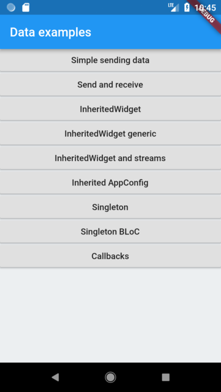
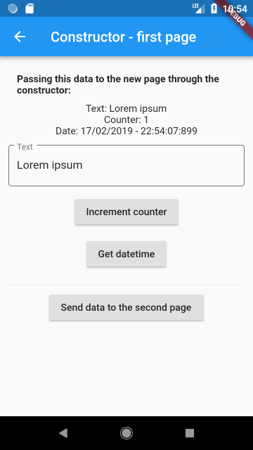
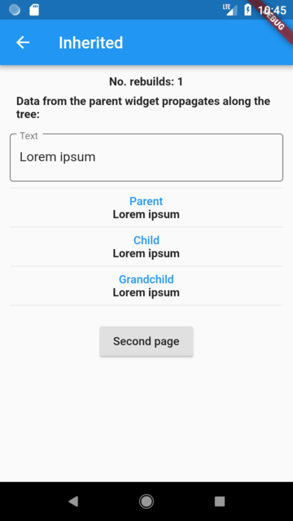
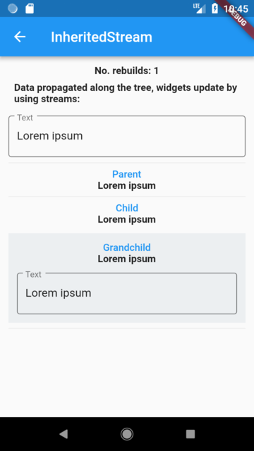
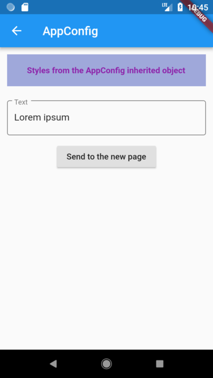
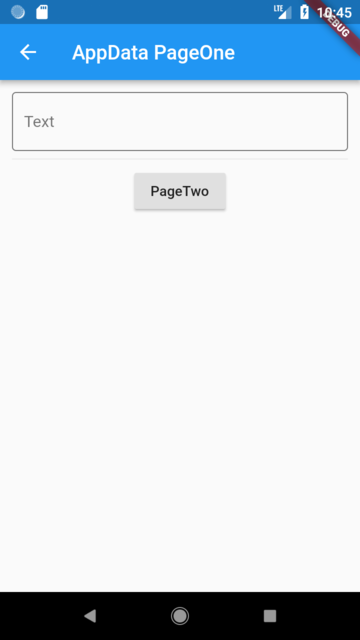

# Pass and share data example

An example app showing different ways to pass to and share data with widgets and pages.

- Passing data through constructor
- Getting data from Navigator.pop
- InheritedWidget
- InheritedWidget and streams
- InheritedWidget generic provider
- Singleton
- Global singleton BLoC
- Callbacks

### Packages used:

- [Intl](https://pub.dartlang.org/packages/intl)
- [Frideos-flutter](https://pub.dartlang.org/packages/frideos)

## Screenshots

r